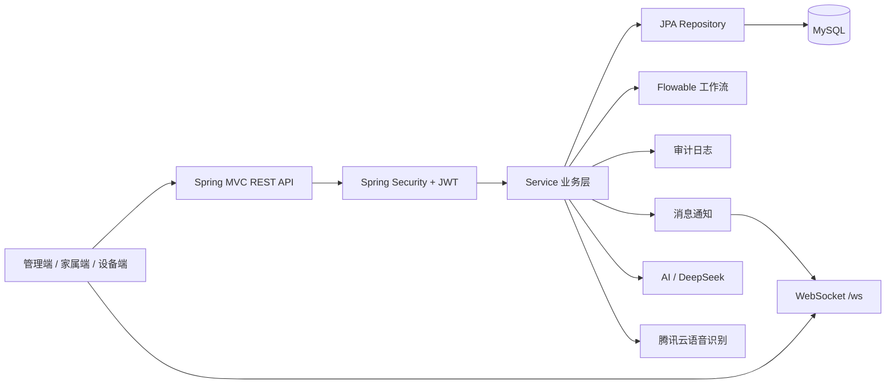
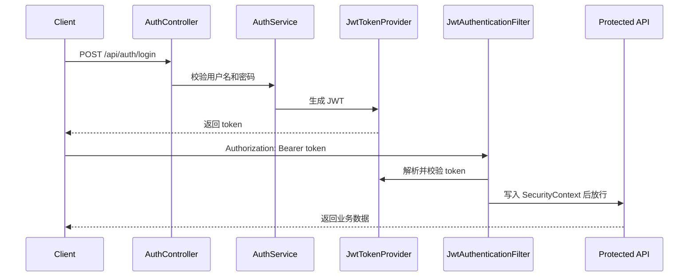
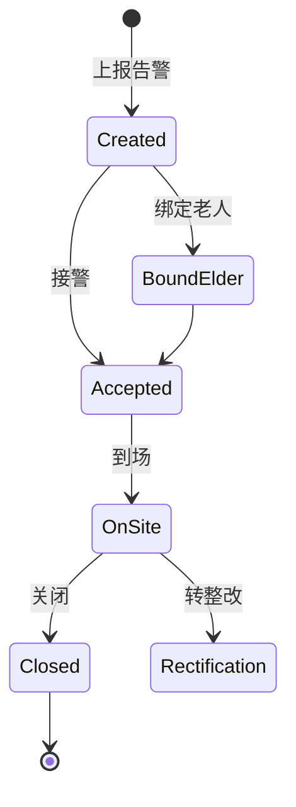
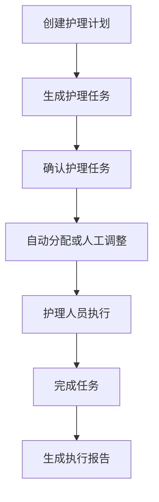

# 颐养云端养老院管理系统后端

## 项目简介

颐养云端养老院管理系统后端是一个面向养老院日常运营管理的 Spring Boot 单体后端服务，提供用户认证、权限控制、老人档案、护理计划、护理任务、健康体征、告警处置、探视申请、排班管理、库存管理、收费账单、质检整改、工作流审批、消息通知、统计分析等能力。

项目围绕养老机构“人、房、床、护理、健康、告警、流程、家属协同”的核心业务建模，采用 Controller、Service、Repository、Entity、DTO 分层结构，并按业务域拆包，便于后续扩展和维护。


## 技术栈

| 类型 | 技术 |
| --- | --- |
| 基础框架 | Java 17、Spring Boot 3.2.12 |
| Web | Spring MVC、Validation |
| 安全认证 | Spring Security、JWT、RBAC、方法级权限控制 |
| 数据访问 | Spring Data JPA、Hibernate、MySQL |
| 流程引擎 | Flowable 7.2.0 |
| 实时通知 | WebSocket、STOMP、SockJS |
| 审计与扩展 | Spring AOP、审计注解 |
| AI / 语音 | OpenAI 兼容 AI Client、DeepSeek、腾讯云语音 SDK |
| 构建测试 | Maven、JUnit、H2 Test Database |
| 辅助工具 | Lombok、JJWT |

## 核心功能

| 模块 | 功能说明 |
| --- | --- |
| 登录认证与权限 | 用户登录、JWT 签发、当前用户信息、角色权限、权限点校验、业务范围校验。 |
| 用户与档案 | 后台用户管理、老人档案、员工档案、家属与老人绑定、敏感信息访问审计。 |
| 入住与退住 | 入住申请、入住详情、退住申请、费用结算、退住完成。 |
| 护理计划 | 护理计划创建、修改、删除、详情、列表、执行报告、变更申请与审核。 |
| 护理任务 | 按护理计划生成任务、确认任务、批量删除、批量确认、批量调整时间和责任人、逾期查询、任务完成。 |
| 日常护理记录 | 膳食、饮水、排便、体重等照护记录的新增、查询、修改和删除。 |
| 健康体征 | 体温、血氧、心率、血压、血糖等记录管理，支持 Apple Watch 设备上传。 |
| 告警处置 | 告警上报、查询、接警、到场、关闭、绑定老人、转整改、告警文件上传。 |
| 排班交接 | 员工排班、个人排班、周视图、批量排班、复制周排班、班次交接、重点老人交接。 |
| 探视 / 外出 | 家属申请、确认、审批、驳回、签到、签出、取消。 |
| 活动管理 | 活动维护、报名、批量报名、签到、取消、参与人统计。 |
| AI 辅助 | AI 护理计划生成、活动语音上传、语音识别、活动表单解析和确认入库。 |
| 药品用药 | 药品维护、用药计划、用药计划状态变更、用药记录登记和查询。 |
| 设施管理 | 楼栋、楼层、房间、床位、摄像头维护及状态管理。 |
| 库存管理 | 物资、库存、库存调整、领用记录管理。 |
| 收费账单 | 费用项目、账单生成、账单详情、缴费记录。 |
| 质检整改 | 质检巡查、质检问题、整改事项、整改动作和状态流转。 |
| 工作流 | 流程实例、任务领取、任务完成、合同模板、合同导入和附件下载。 |
| 消息通知 | 站内消息、已读标记、通知列表、WebSocket 推送。 |
| 统计分析 | 告警、任务、用药、入住率、人员等运营统计。 |
| 审计日志 | 登录、查看、创建、更新、删除、审批、状态流转等关键操作记录。 |

## 项目结构

```text
.
├── mvnw / mvnw.cmd
├── pom.xml
├── README.md
├── docs/images
│   ├── system-architecture.svg
│   ├── auth-flow.svg
│   ├── alarm-flow.svg
│   ├── care-task-flow.svg
│   └── database-er.svg
└── src
    ├── main
    │   ├── java/com/wanghao/eldercare/eldercaresystem
    │   │   ├── EldercareSystemApplication.java
    │   │   ├── common        # 通用响应、异常、安全、审计、WebSocket、文件配置
    │   │   ├── controller    # REST 接口层，按业务域拆包
    │   │   ├── dto           # 请求与响应对象
    │   │   ├── entity        # JPA 实体
    │   │   ├── mapper        # Spring Data JPA Repository
    │   │   └── service       # 业务服务层
    │   └── resources
    │       ├── application.yml
    │       ├── application-example.yml
    │       ├── db            # 初始化与增量 SQL
    │       ├── processes     # Flowable BPMN 流程定义
    │       └── contract-templates
    └── test                  # 模块测试与单元测试
```

## 系统架构


整体调用链如下：



## 运行环境

- JDK 17+
- Maven 3.8+，也可以使用项目自带 Maven Wrapper
- MySQL 8+
- 可选：ffmpeg，用于语音识别前的音频处理
- 默认服务端口：`8080`

## 本地启动

### 1. 创建数据库

```sql
CREATE DATABASE smart_nursing_home
  DEFAULT CHARACTER SET utf8mb4
  COLLATE utf8mb4_unicode_ci;
```
可以导入目录里的sql文件 

### 2. 修改配置

参考 `src/main/resources/application-example.yml`，配置本地数据库、JWT、AI、语音识别和文件上传目录。

核心配置示例：

```yaml
spring:
  datasource:
    url: jdbc:mysql://127.0.0.1:3306/smart_nursing_home?useUnicode=true&characterEncoding=UTF-8&serverTimezone=Asia/Shanghai&useSSL=false&allowPublicKeyRetrieval=true
    username: your_mysql_username
    password: your_mysql_password

server:
  port: 8080

jwt:
  secret: please-change-this-jwt-secret-in-local-config
  expirationSeconds: 7200

file:
  storage-dir: uploads
```

外部服务相关环境变量：

```bash
export AI_API_KEY=your_ai_api_key
export AI_BASE_URL=https://api.deepseek.com
export AI_MODEL=deepseek-chat
export DEEPSEEK_API_KEY=your_deepseek_api_key
export TENCENT_SPEECH_SECRET_ID=your_tencent_secret_id
export TENCENT_SPEECH_SECRET_KEY=your_tencent_secret_key
```

如果本地没有 AI 或语音识别服务，可以将对应 mock 配置打开，或避免调用相关接口。

### 3. 初始化数据库

数据库脚本位于 `src/main/resources/db`。

常用初始化脚本：

```text
init-auth.sql
init-rbac.sql
alarm-mvp.sql
create-care-plan-tasks.sql
create-staff-shift-schedule.sql
care-team-assignment.sql
digital-twin.sql
```

增量脚本包括：

```text
alter-admission-records-contract-file-url.sql
alter-care-plan-tasks-list-query-index.sql
alter-care-plan-tasks-schedule.sql
alter-care-plans-structured.sql
alter-facility-soft-delete.sql
alter-users-soft-delete.sql
alter-vital-sign-records-device.sql
flowable-workflow-migration.sql
flowable-act-table-comments.sql
```

`spring.jpa.hibernate.ddl-auto` 配置为 `none`，业务表需要通过 SQL 脚本维护。Flowable 表由 `flowable.database-schema-update: true` 支持自动创建和更新。

### 4. 启动服务

```bash
./mvnw spring-boot:run
```

或：

```bash
mvn spring-boot:run
```

启动后访问：

```text
http://localhost:8080
```

## 测试

运行全部测试：

```bash
./mvnw test
```

运行单个模块测试示例：

```bash
./mvnw -Dtest=CarePlanTaskModuleTests test
./mvnw -Dtest=AuthSecurityTests test
./mvnw -Dtest=WorkflowModuleTests test
```

测试覆盖认证、权限、护理计划、护理任务、健康体征、告警、排班、探视、活动、药品、库存、账单、质检、整改、工作流、消息通知、审计日志等模块。

## 接口说明

接口基础地址：

```text
http://localhost:8080
```

登录接口：

```http
POST /api/auth/login
Content-Type: application/json

{
  "username": "admin",
  "password": "admin123"
}
```

受保护接口需要携带 JWT：

```http
Authorization: Bearer <token>
```

常用接口示例：

| 功能 | 方法 | 路径 |
| --- | --- | --- |
| 健康检查 | `GET` | `/api/ping` |
| 登录 | `POST` | `/api/auth/login` |
| 当前用户 | `GET` | `/api/auth/me` |
| 用户列表 | `GET` | `/api/admin/users` |
| 新增用户 | `POST` | `/api/admin/users` |
| 老人档案列表 | `GET` | `/api/profiles/elders` |
| 老人档案详情 | `GET` | `/api/profiles/elders/{elderId}` |
| 员工档案列表 | `GET` | `/api/profiles/staff` |
| 入住申请 | `POST` | `/api/admissions` |
| 入住列表 | `GET` | `/api/admissions` |
| 退住申请 | `POST` | `/api/discharges` |
| 护理计划列表 | `GET` | `/api/care-plans` |
| 新增护理计划 | `POST` | `/api/care-plans` |
| 护理计划执行报告 | `GET` | `/api/care-plans/{carePlanId}/execution-report` |
| 生成护理任务 | `POST` | `/api/care-plans/{carePlanId}/generate-tasks` |
| 确认护理任务 | `POST` | `/api/care-plans/{carePlanId}/confirm-tasks` |
| 我的护理任务 | `GET` | `/api/care-plan-tasks/my` |
| 完成护理任务 | `PUT` | `/api/care-plan-tasks/{taskId}/complete` |
| 膳食记录 | `POST` | `/api/care/meal-records` |
| 体征上传 | `POST` | `/api/health/vitals` |
| Apple Watch 体征上传 | `POST` | `/api/health/vitals/apple-watch` |
| 告警上报 | `POST` | `/api/alarms` |
| 告警列表 | `GET` | `/api/alarms` |
| 告警接警 | `POST` | `/api/alarms/{alarmId}/accept` |
| 告警到场 | `POST` | `/api/alarms/{alarmId}/arrive` |
| 告警关闭 | `POST` | `/api/alarms/{alarmId}/close` |
| 排班列表 | `GET` | `/api/staff-shifts` |
| 批量排班 | `POST` | `/api/staff-shifts/batch` |
| 探视申请 | `POST` | `/api/visits` |
| 探视审批 | `POST` | `/api/visits/{id}/approve` |
| 活动列表 | `GET` | `/api/activities` |
| 活动语音录入 | `POST` | `/api/activities/ai/upload-voice` |
| AI 护理计划生成 | `POST` | `/api/ai/care-plan/generate` |
| 用药计划 | `GET` | `/api/medication-plans` |
| 库存物资 | `GET` | `/api/inventory/items` |
| 账单列表 | `GET` | `/api/billing/bills` |
| 质检列表 | `GET` | `/api/qc/audits` |
| 整改列表 | `GET` | `/api/rectifications` |
| 工作流任务 | `GET` | `/api/workflows/tasks/my` |
| 审计日志 | `GET` | `/api/audit-logs` |
| 统计接口 | `GET` | `/api/stats/alarms`、`/api/stats/tasks`、`/api/stats/medication`、`/api/stats/occupancy`、`/api/stats/personnel` |

WebSocket 配置：

```text
Endpoint: /ws
订阅前缀: /topic、/queue
应用前缀: /app
用户前缀: /user
```

## 权限与安全

系统使用 JWT + Spring Security 做统一认证。除少量开放接口外，`/api/**` 默认需要登录。

当前开放接口包括：

- `POST /api/auth/login`
- `POST /api/alarms`
- `POST /api/alarm-files/upload`

权限控制方式：

- `@PreAuthorize`：按角色控制接口访问。
- `@RequirePerm`：按 RBAC 权限点控制操作能力。
- `@ElderScoped`：按老人绑定关系限制家属或老人端访问范围。
- `@BizScoped`：按业务对象范围限制数据访问。
- `@Audited`：记录关键业务操作和敏感信息访问。

常见角色包括：

```text
ADMIN
NURSE_LEADER
NURSE
CAREGIVER
DOCTOR
FAMILY
ELDER
```

## 业务流程图

### 登录鉴权流程




### 告警处置流程




### 护理任务流程




## 数据库与资源

数据库 ER 图：


主要资源目录：

| 目录 | 说明 |
| --- | --- |
| `src/main/resources/db` | 数据库初始化和增量变更脚本 |
| `src/main/resources/processes` | Flowable BPMN 流程定义 |
| `src/main/resources/contract-templates` | 入住护理服务合同模板 |
| `docs/images` | 系统架构图、流程图、ER 图 |
| `uploads` | 默认本地上传文件目录 |

## 项目亮点

- 业务覆盖面完整，覆盖养老机构从入住、档案、护理、健康、告警、排班到费用、质检、统计的主要管理环节。
- 护理计划和护理任务关联紧密，支持生成、确认、批量调整、自动分配、执行报告和逾期提醒。
- 权限体系结合角色、权限点、业务范围和审计日志，适合多角色后台和家属端协同场景。
- 告警处置流程清晰，支持上报、接警、到场、关闭、绑定老人和转整改。
- 接入 Flowable，支持入住相关流程实例、任务领取、任务完成、合同模板和附件管理。
- 支持 WebSocket 实时消息通知，适合告警、站内消息等即时业务场景。
- 预留 AI 与语音能力，支持 AI 护理计划生成和活动语音录入解析。
- 测试覆盖多个业务模块，适合作为毕业设计后端项目展示和答辩说明。

## 注意事项

- 不要将真实数据库密码、JWT 密钥、AI Key、腾讯云 SecretId / SecretKey 提交到仓库。
- `application-example.yml` 是示例配置，本地运行时请按环境修改 `application.yml`。
- 业务表结构由 SQL 脚本维护，首次运行前需要初始化数据库。
- `src/main/resources/db` 下既有初始化脚本，也有增量脚本，执行前请结合当前数据库状态判断顺序。
- 文件上传默认保存到 `uploads`，生产环境建议改为固定磁盘目录或对象存储。
- AI 和语音识别依赖外部服务，缺少 Key 时相关接口可能不可用。
- 当前跨域和本地配置偏开发环境，生产部署时应收敛跨域来源、密钥管理和日志级别。

